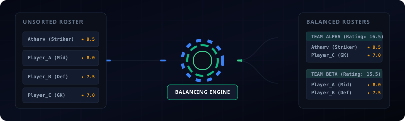

<!-- Animated Header Banner -->
<div align="center">
  
</div>

<br/>

<!-- Typing SVG Sub-header -->
<div align="center">
  
</div>

<div align="center">
  <a href="https://www.linkedin.com/in/atharv-dev" target="_blank">
    
  </a>
  &nbsp;
  <a href="mailto:atharv3444@gmail.com">
    
  </a>
  &nbsp;
  <a href="https://instagram.com/beingatharvsrivastava_" target="_blank">
    
  </a>
  &nbsp;
  <a href="https://atharvportfolio-eight.vercel.app" target="_blank">
    
  </a>
</div>

<br/>

<div align="center">
  
</div>

---

## ⚡ About Me

<div align="center">
  
</div>

---

## 🚀 Signature Projects

### 🤖 AI Career Twin — Multi-Agent AI SaaS Platform
> **Status:** `🟢 Active Development` &nbsp;|&nbsp; **Demo:** [ai-careertwin.vercel.app](https://ai-careertwin.vercel.app) &nbsp;|&nbsp; **Backend:** `FastAPI` &nbsp;|&nbsp; **Frontend:** `Next.js`

An intelligent, multi-agent career companion that provides automated resume scanning, LinkedIn optimization, and mock interviews. Powered by an async agent coordination pipeline.

<!-- Architecture Diagram (Direct flex of engineering system design) -->
<div align="center" style="margin-top: 15px; margin-bottom: 20px;">
  
</div>

<details>
<summary><b>🔍 System Specifications &amp; Features</b></summary>

| Module | Technical Implementation |
|:---|:---|
| 🧠 **8 Specialized Agents** | Structured LLM routers built with PydanticAI &amp; custom validation layers. |
| 🗄️ **RAG Pipeline** | pgvector embeddings with semantic search threshold filters. |
| 🔒 **Granular Security** | Supabase Auth coupled with strict PostgreSQL Row-Level Security (RLS) tables. |
| ⚡ **Async Processing** | Non-blocking Python FastAPI workers executing background agent tasks. |
</details>

---

### ⚽ Team Balancer — Production Sports Team Generator
> **Status:** `🟢 Live in Production` &nbsp;|&nbsp; **Demo:** [balanceteams.com](https://balanceteams.com) &nbsp;|&nbsp; **Stack:** `Next.js · TypeScript · Supabase · PostgreSQL`

A fair-distribution team builder that generates skill-balanced sports teams using a custom-weighted balancing engine.

<!-- Algorithmic Flow Diagram -->
<div align="center" style="margin-top: 15px; margin-bottom: 20px;">
  
</div>

<details>
<summary><b>⚖️ Algorithmic Implementation Details</b></summary>

| Optimization | Description |
|:---|:---|
| ⚖️ **Weighted Balancing** | A seedable distribution engine that balances player skill attributes across rosters. |
| 📋 **Audit Trails** | Complete permanent session audit logging utilizing Supabase PostgreSQL triggers. |
| 🛡️ **Row-Level Security** | Custom Supabase policies ensuring users can only read/write their own rosters. |
| 📱 **Edge Architecture** | Fully responsive layout caching public static rosters at the edge with Cloudflare. |
</details>

---

### 🌐 Atharv Portfolio — Interactive Creative Portfolio
> **Status:** `🟢 Live` &nbsp;|&nbsp; **Demo:** [atharvportfolio-eight.vercel.app](https://atharvportfolio-eight.vercel.app) &nbsp;|&nbsp; **Stack:** `React · Vite · GSAP · Framer Motion`

A premium, highly interactive personal portfolio showcasing custom creative animations, a physics-based interactive constellation particle web, and an integrated AI concierge assistant.

<details>
<summary><b>✨ Interactive Features &amp; Motion Design</b></summary>

| Component | Technical Implementation |
|:---|:---|
| 🌌 **Constellation Canvas** | Interactive nodes-and-links canvas responding to cursor magnetism and scroll velocity. |
| 💬 **Concierge Assistant** | Built-in custom conversational assistant designed to answer queries about projects and skills. |
| 🌀 **Kinetic Animations** | Fine-tuned scroll triggers and entrance sequences using GSAP and Framer Motion. |
| ⚡ **Vite Bundler** | Optimized asset bundling and fast hot module replacement for fluid performance. |
</details>

---

## 🛠️ Interactive Tech Stack

Hover over the badges in the console below to see them light up with their brand colors.

<div align="center">
  
</div>

---

## 📊 Engineering Analytics

<!-- Custom Note explaining self-hosting to prevent broken images (Flexes DevOps skills) -->
> [!TIP]
> **DevOps Tip**: If GitHub stats images fail to load due to GitHub caching (Camo 502/404), self-host your own instance of `github-readme-stats` on Vercel in 1 click to bypass rate limits!

<div align="center">
  
  &nbsp;
  
</div>

<div align="center">
  
</div>

<details>
<summary><b>🏆 View GitHub Trophies</b></summary>
<br/>
<div align="center">
  
</div>
</details>

---

## 📅 Chronology

```
2025 ── Commenced B.Tech AI &amp; Data Science @ ADYPU, Pune
         ├─ Mastered DSA, OOP &amp; Statistical Mathematics foundations
         └─ Deployed Team Balancer MVP (Next.js + Supabase + Postgres)

2026 ── Completed Year 1 | CGPA 8.0
         ├─ Created AI Career Twin (Next.js + FastAPI + pgvector)
         ├─ Designed RAG systems using async Python microservices
         └─ Focus: Multi-Agent Architectures, Vector search &amp; Cloud databases
```

---

## 🤝 Connect

<div align="center">

| Platform | Endpoint |
|:---|:---|
| 📧 **Email** | [atharv3444@gmail.com](mailto:atharv3444@gmail.com) |
| 💼 **LinkedIn** | [linkedin.com/in/atharv-dev](https://www.linkedin.com/in/atharv-dev) |
| 📸 **Instagram** | [@beingatharvsrivastava_](https://instagram.com/beingatharvsrivastava_) |
| 🌐 **Portfolio** | [atharvportfolio-eight.vercel.app](https://atharvportfolio-eight.vercel.app) |

</div>

---

<div align="center">
  <sub>⚡ <i>When I'm not writing code, I'm hitting PRs in the gym or grinding in BGMI</i> 🏋️‍♂️🎮</sub>
</div>
